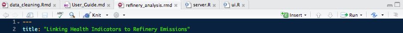

# Meaning from Monitoring
This is a project to examine the public health impacts of emissions from oil refineries in the Bay Area. It is a project of the Fair Tech Collective, led by Gwen Ottinger, Associate Professor, Drexel University and Dawn Nafus, Intel.

This open-source code allows citizen scientists and community health advocates to gather statistical evidence of personal and public health impacts from refinery pollution. The code is entirely modifiable, requiring only knowledge of the R programming language. However, knowledge of R is not needed to gather statistics from your data. We have clearly marked a few areas that require input, so it is like filling out a document rather than coding from scratch (FYI that's also possible). Not fun, but easy, and gives meaning to your monitoring.

### Project home:
+ https://www.fairtechcollective.org/experiments/

### Content websites:
+ http://www.fenceline.org/rodeo/data.php
+ https://esdr.cmucreatelab.org/home
+ http://airwatchbayarea.org/
+ https://makesenseofdata.com/#!/experiments/my

# Executive summary for using these tools

## R
You need to download [R](https://cran.cnr.berkeley.edu/) and [RStudio](https://www.rstudio.com/products/RStudio/#Desktop). Both are free. Make sure to download the correct R version for your operating system and the desktop version of RStudio.

The versions used to create the code are listed below. Other versions may or may not work with the code.

+ RStudio version 1.0.153
+ R version 3.4.0

This is the key package needed for the code. The code installs and/or loads it automatically, but just in case the version is listed below.

+ tidyverse version 1.1.1

And finally, this is a highly recommended tutorial for getting started with R, however the code does not require you to know the language. The analysis only requires following specified directions, but you may elect to tinker with the code. In the references document, you can find more assistance.

+ http://r4ds.had.co.nz/introduction.html

## Data
You need to collect your data, and make sure it is in the right location to be read by the code. The key datasets are: 

1. Symptoms reporting (Paco)
2. Fitbit
3. Refinery pollution
4. GPS/ Demographic data. 

The sources of these data are listed in the [references document](https://github.com/niklaslollo/refinery-stats/blob/master/references.md).

## Manipulating the code
There are three key documents - data_cleaning.Rmd, refinery_analysis.Rmd, and server.R (in ej-app). First you need to clean your data. Throughout the data_cleaning script, there are various user inputs and selections. These are marked in the code, and noted in the detailed User Guide. For instance, you will be asked to make the timeframe, id's, and exposure windows relevant for your project.

Once the data is clean, the new data files should be ready for analysis. First, use the ej-app (server.R) to conduct exploratory analysis. The ej-app can be viewed on your desktop or in your browser. Then, use refinery_analysis.Rmd for more advanced statistical procedures and to print a PDF.

## To print a report
Results will appear in-line (i.e. within RStudio), however if you want to print a report and share it as a PDF, click `Knit` in the icon bar right above the code window. This will generate a PDF which you can save to your desktop.
