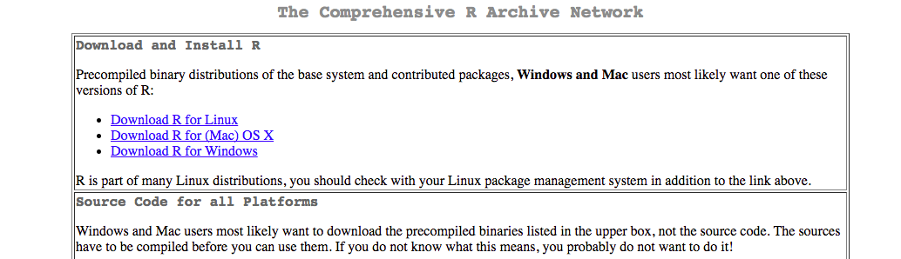
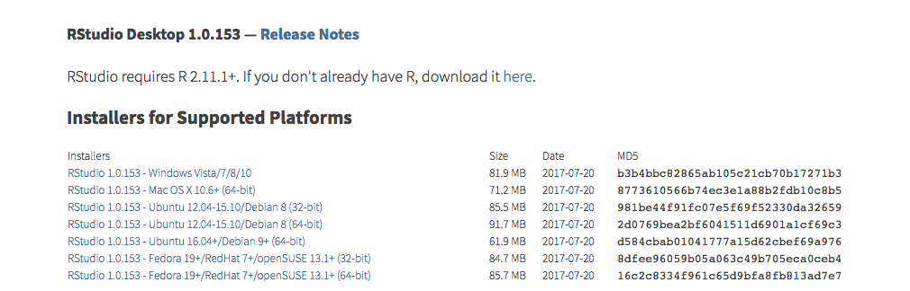
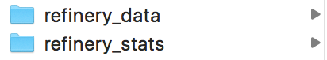
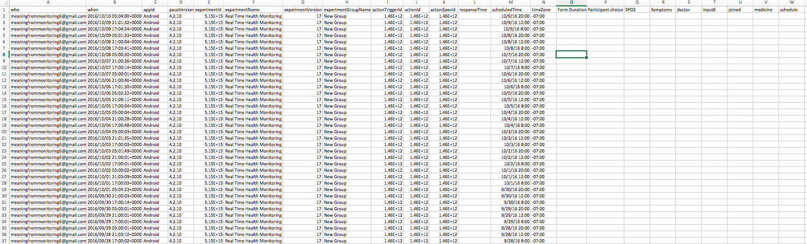
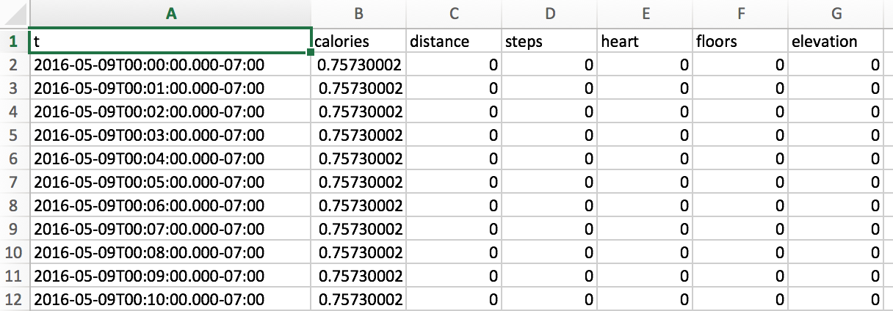
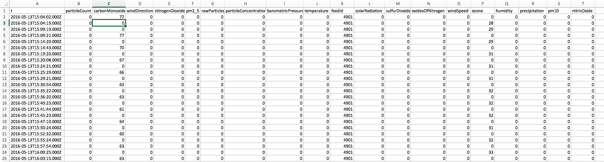
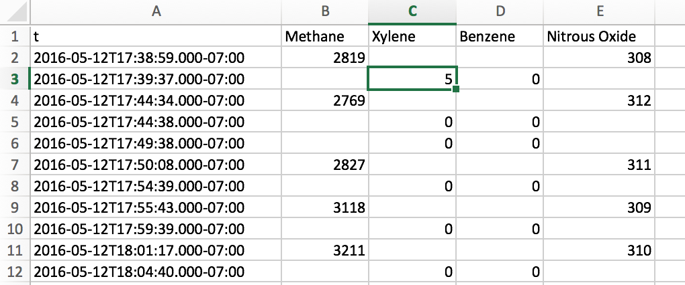
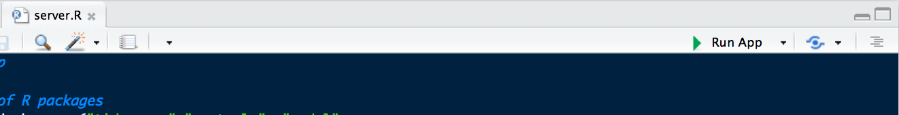
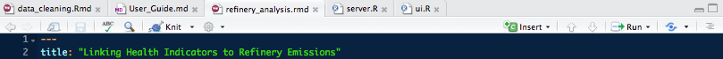

# Detailed Instructions
## If you haven't used R before

**First**, download R at this [webpage](https://cran.cnr.berkeley.edu/).

**Next**, download RStudio [here](https://www.rstudio.com/products/rstudio/download/#download). RStudio is a user interface to easily work with R. 

Create two side-by-side folders. One is titled: "refinery_data" while the other is "refinery_stats." 

Download the analysis file (*refinery-analysis.rmd*) from github [https://github.com/niklaslollo/refinery-stats/](https://github.com/niklaslollo/refinery-stats/), put it in "refinery-stats." Double-click on the file and RStudio should open. 

## Once you've installed and set-up R

Acquire the datasets:

  1. Individual diary data
    + Includes blood oxygen and symptoms reporting
    + There should be one dataset with a column for id
  2. Fitbit
    + Within day data for all users
    + These will be separate datasets
  3. Pollution data
    + Feed 4901
    + Feed 4901 Methane
    + Feed 4902
    + Feed 4902 Methane
  4. GPS/ Demographic data
  
Put these datasets side-by-side in the "refinery_data" folder.

## Data management
Here is how each dataset should look. Please make sure you follow this template exactly.

1. **Individual Diary**
    + User inputted reports. These should be collated into one file. 
  
2. **Fitbit**
    + Within day activity for each participant. 
  
3. **Pollution**
    + Feed data for non-methane 
    + Feed data for methane 
  
4. **GPS/ Demographics**

## Data Cleaning
**Open the Document**
The document you want to open is data_cleaning.Rmd


**1. Loading packages**

  + If this is your first time running the code, make sure these two lines do not have a `#` in front of them. This `#` "comments out" the code and it will not run. You need to install the packages the first time. Every other time, you only need to load the packages and can put a `#` in front of them.
    + `pkgs_not_installed <- required_pkg[!sapply(required_pkg, function(p) require(p, character.only=T))]`
    + `install.packages(pkgs_not_installed, dependencies=TRUE)`

**2. Timeframe**

  + What are the project start and end date? Select the very beginning of the data and the very end even if no individual dataset runs for the entire length.
  + Insert your dates in the exact same format given: e.g. `2016-05-09 14:00`. Replace the code given for start and end date.
  
  ```
  
    date_begin = "2016-05-09 14:00"
  
    date_end = "2016-08-11 0:00"
  
  ```

**3. Loading pollution data**

  + General principle: `read_csv` simply reads the csv listed at the end of a given filepath. If you have followed my suggested folder structure, the code should simply work. However, a few things to note: `..` means go "up" one folder. You will start wherever you have saved refinery-analysis.rmd.
  + Pollution: Make sure to do this for all four datasets, two each from feed 4902 and 4901.

**4. Exposure window**

  + The next entry point is the exposure window. This is automatically set at `8` hours. If you would like to change that, in the `r exposure window` code chunk you will find a parameter called `width`. Feel free to use `ctrl-F` to locate this. Change the number to change the exposure window. You can also change `sulfur_dioxide` to your pollutant of choice. Make sure to rename the variable from `sulfur_dioxide_exposure_window` to a new name. I recommend using `ctrl-F` to find and replace all instances of the old name.
  
  ```
  
    sulfur_dioxide_exposure_window =
  
      zoo::rollapply(sulfur_dioxide,
      
                     width = 8, #TO DO: Select number of hours to include 
                     
                     FUN = mean, #function is mean
                     
                     na.rm = T, #avoids NA 
                     
                     partial = T, #skips unnecessary datapoints
                     
                     align = "right")) %>%
                     
  ```
  
**5. Paco data**

  + Load (`read_csv`) in the same way as pollution data above.
  + Change ID's in paco data.
    + `who = replace(who, who=="meaningfrommonitoring3@gmail.com", "m3")` - This code takes any entries listed as "meaningfrommonitoring3@gmail.com" and replaces it with "m3." You need to do this with all ID's of interest. You get to select your ID names. 
    + `filter(id == "m3" | id == "m5")` - Change the ID's here to match the ID's you entered above. Make sure to use `==` and `|` and `""` in this step.
    + You need to repeat step #2 (`filter`) in the next group of code, almost directly below.
  
**6. Fitbit data**

  + Load (`read_csv`) the user specified dataframes in the same way as above. This time, however, we use a `%>%` to move to the next function call that creates (`mutate`) a new column called id. The entry of this column should be equal to the `ID` of the user in question. These should match the paco data above.
  + Name the dataframes according to the ID's. e.g. for `fb_intraday_m16 <-` change the `m16` part.
    + e.g. `mutate(id = "m16")` - Note in this case we only use one `=`
  + After `# Combine dataframes` you need to make sure the datasets specified are the same names that you inputted above. Don't change the name of this dataframe.
  + After `rm(` input all the dataframes you just loaded, except for the merged data.
  + You will need to `filter` for your ID's of interest here as well.
  
**7. Demographic data**

!!

## Working with your Clean Data

### Using the ej-app for exploratory analysis
At this point, you should simply be able to open `server.R` in RStudio. Once you do, in the top right, you will see . Click that button and a new window will open. 

This interface should be intuitive. However, it includes four pages denoted by the sidepanel. 

The first shows each ID and the associated home location. Hover over the ID for more information about that individual. At the bottom of the page there are filters for you to use. *These will affect the other pages, so be careful.* 

The next page shows correlations between individual health indicators and refinery pollutant data.

The third page shows how values change over the space. The background is Contra Costa County.

The fourth page brings in the Cal Enviro Screen webmap. Use this to understand if a particular ID might be receiving more or less cumulative burden than others.


### Using the refinery_analysis.Rmd

**8. Filters**

  + In the next code chunk `TO DO filter your data`, you will need to select the filters you would like to apply to the analysis. (Note, this is only needed for detailed statistics. You will be able to play with the interactive plots, but those will not provide statistics at this point.) In order to filter, you will need do two things:
  1. Get rid of the `#` at the front of the `filter` line under the `# Merged dataframe` header.
  2. Enter the filters in the parentheses.
    + For text-based filters, the formula to follow is `variable_name` `symbol` `"entry"`. The symbols you can use are `==` for matches exactly, `!=` for does not match or, slightly more advanced `%in%` followed by a grouping of entries like `c("black", "white")`. Note that each entry has "" around it.
    + For numbers-based filters, the same basic formula applies: `variable_name` `symbol` `number`. The symbols can be `==`, `!=`, `>`, `<`, `>=`, `=<`, or again `%in%` with a grouping such as `c(55:65)`.
  3. Combine filters
    + In order to apply more than one filter, you will need to decide how they should be combined. The choices are simple: `&` (and) or `|` (or). So if you want to only examine black females, you would enter `filter(race == "black" & sex == "female")` but if you wanted black or female, you would simply replace `&` with `|`. If you want to combine conditions, use parentheses. For example, if you want to examine white males and those over 50, you would write `filter((race =="white" & sex == "male") | age > 50)`.

**9. Making plots**

To make your plot, you will need to simply follow the format provided. For example: 
```
my_plot(health_var = heart_rate,
        health_var_name = "Heart Rate",
        health_var_units = "bpm",
        pollutant_var = methane,
        pollutant_var_name = "Methane",
        pollutant_var_units = "ppb")
```
In this case, if you want to change the health indicator, you would change the first three entries. So instead of `heart_rate`, you would write `blood_oxygen`. Never change the values before the `=`.

**10. Spatial analysis**

The spatial files are located in the github in folder `data/location/`. Download both the folders within `location` and place in a folder called `data` contained within `refinery_stats`. 

  + Plotting points in space

The only code you need to change (if you want) is the final chunk
```
# Plot heart rate over space
r + 
  geom_point(data=spatial_df, 
             aes(x=longitude, y=latitude,
                 color = heart_rate), 
             na.rm = T)
```
In this case, you will change the `color` to your variable of interest. Any variable should be able to fit. This will give you a plot of that variable over the contra costa county.

  + Testing for autocorrelation
  
In this test, you again only need to change one value. Here is the test:

```
# Moran's I Monte Carlo
moran_out <- moran.mc(spatial_df$heart_rate,
                      spatial_listw,
                      nsim=99,
                      zero.policy = T,
                      na.action = na.omit)
```
Here you change the first input `spatial_df$heart_rate`. This will still need `spatial_df$`. You will append your variable of interest. The output will tell you if e.g. heart rate is correlated with location. This may or not be visible in the previous plot.

  + Using the Cal Enviro Screen data

After running the first three lines of code, it is recommended to familiarize yourself with data and columns. Please run
```
head(ces_lat_cc@data)
```
and view the columns in the console.

Then,
```
# Map (e.g. the cardiovascular scores)
ggplot(waterDF, 
       aes(x=long, y=lat,
           group = group,
           fill = Cardiovasc)) +
  geom_polygon()  +
  geom_path(color = "white") +
  scale_fill_gradient(
    low = "plum1", high = "purple4",
    breaks=c(500000,1000000,1500000),
    labels=c("Low","Medium","High")) +
  coord_map("mercator") + 
  ggtitle("Cardiovascular Health")
```
Here you will change a few values. First, you will change `fill` to a variable of interest. This variable will come from the dataset you just examined. Next, you will change the breaks to represent values at reasonable intervals of the variable. Then you will change `ggtitle` to make the title of the plot.

**Print your report**
Results will appear in-line (i.e. within RStudio), however if you want to print a report and share it as a PDF, click `Knit` in the icon bar right above the code window. This will generate a PDF which you can save to your desktop.


