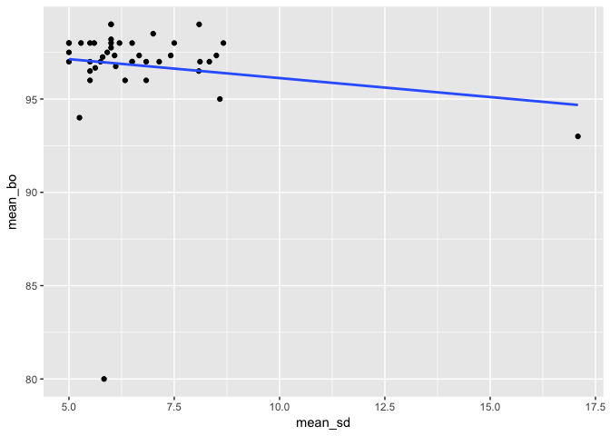
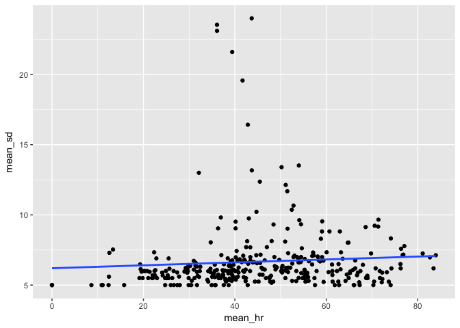
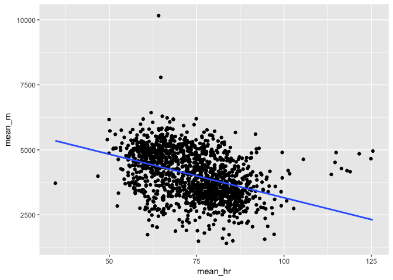

Refinery Analysis
================
Niklas Lollo

### Content websites:

-   <http://www.fenceline.org/rodeo/data.php>
-   <https://esdr.cmucreatelab.org/home>
-   <http://airwatchbayarea.org/>
-   <https://makesenseofdata.com/#!/experiments/my>

### For R:

-   <http://r4ds.had.co.nz/introduction.html>
-   Rstudio version 1.0.143
-   R version 3.4.0
-   tidyverse version 1.1.1

Setup
-----

### Load Air Quality Data

``` r
# load air quality data
feed_4902 <- read_csv("../refinery_data/airQuality_feed4902_data.csv")
feed_4901 <- read_csv("../refinery_data/airQuality_feed4901_data.csv")
feed_4902_methane <- read_csv("../refinery_data/airQuality_N20_methane_4902_data.csv")

# Make hourly averages
## Set zero's to NA to not "mess up" average
feed_4902[feed_4902 == 0] <- NA
## Create new dataframe
hourly_4902 <- feed_4902 %>%
  # Select the day and hour of interest (get rid of minute and seconds)
  group_by(
    # Creates new variables
    day = as.POSIXct(cut(t, breaks='hour'))) %>%
  summarise(
    # Averages
    sulfur_dioxide = mean(sulfurDioxide, na.rm=T),
    carbon_monoxide = mean(carbonMonoxide, na.rm=T),
    ozone = mean(ozone, na.rm=T)) %>%
  # Arrange the columns by day
  arrange(day)

# Do the same for the other feed4902 dataframe
feed_4902_methane[feed_4902_methane == 0] <- NA
hourly_4902_methane <- feed_4902_methane %>%
    group_by(
    # Creates new variables
    day = as.POSIXct(cut(t, breaks='hour'))) %>%
  summarise(
    # Averages
    methane = mean(Methane, na.rm=T),
    benzene = mean(Benzene, na.rm=T),
    nitrous_oxide = mean(`Nitrous Oxide`, na.rm=T)) %>%
  # Arrange the columns by day
  arrange(day)

air_qual_4902 <- right_join(hourly_4902, hourly_4902_methane, by = "day") %>%
  mutate(id = "feed_4902")

# Do the same for feed 4901
feed_4901[feed_4901 == 0] <- NA
air_qual_4901 <- feed_4901 %>%
  # Select the day and hour of interest (get rid of minute and seconds)
  group_by(
    # Creates new variables
    day = as.POSIXct(cut(t, breaks='hour'))) %>%
    # Averages
  summarise(
    sulfur_dioxide = mean(sulfurDioxide, na.rm=T),
    carbon_monoxide = mean(carbonMonoxide, na.rm=T),
    ozone = mean(ozone, na.rm=T)) %>%
  mutate(
    id = "feed_4901"
  ) %>%
  # Arrange the columns by day
  arrange(day)

# Remove intermediate dataframes
rm(hourly_4902, hourly_4902_methane)
# Remove original dataframes
rm(feed_4901, feed_4902,feed_4902_methane)
```

### Load Paco Data

``` r
# load paco data
paco <- read_csv("../refinery_data/paco_all.csv")

# Creating new dataframe
paco <- paco %>%
  mutate(
    # Remove extra values (supposed to be a correction)
    when=gsub("\\+0000","",when),
    # Converting / to - part 1
    when=sub("[[:punct:]]","-",when),
    # Converting / to - part 2
    when=sub("\\/","-",when),
    # Rename persons of interest
    who = replace(who, who=="meaningfrommonitoring3@gmail.com", "m3"),
    who = replace(who, who=="meaningfrommonitoring5@gmail.com", "m5"),
    who = replace(who, who=="meaningfrommonitoring7@gmail.com", "m7"),
    who = replace(who, who=="meaningfrommonitoring9@gmail.com", "m9"),
    who = replace(who, who=="meaningfrommonitoring10@gmail.com", "m10"),
    who = replace(who, who=="meaningfrommonitoring11@gmail.com", "m11"),
    who = replace(who, who=="meaningfrommonitoring16@gmail.com", "m16")
  ) %>%
  mutate(
    # Make person column as a factor
    id = as.factor(who),
    # Convert date column to datetime
    t = as.POSIXct(when, tz="GMT", format="%Y-%m-%d %H:%M:%S")) %>%
  # Remove columns not of interest
  select(-c(who, when, appId, pacoVersion, experimentId,
            experimentName, experimentVersion, experimentGroupName,
            actionTriggerId, actionId, actionSpecId, responseTime,
            scheduledTime, timeZone)) %>%
  # Select persons of interest 
  filter(id == "m3" | id == "m5" | id == "m7" |
      id == "m9" | id == "m10" | id == "m11" |
      id == "m16") %>% 
  arrange(t)
# Remove incorrect values
paco$SPO2[paco$SPO2 == 0 | paco$SPO2 > 100 | paco$SPO2 < 80] <- NA
# Make hourly dataframe
paco_hourly <- paco %>%
  # Select the person, day and hour of interest
  group_by(id,
    # Creates new variables
    day = as.POSIXct(cut(t, breaks='hour'))) %>%
    # Average
  summarise(blood_oxygen = mean(SPO2, na.rm=T)) %>%
  filter(is.na(blood_oxygen) == F) %>%
  # Arrange the columns by person
  arrange(id)
```

### Load Fitbit Data

``` r
# Load fitbit data
fb_body <- read_csv("../refinery_data/fitbit_body_data.csv")
fb_activities <- read_csv("../refinery_data/fitbit_activities_data.csv")
fb_sleep <- read_csv("../refinery_data/fitbit_sleep_data.csv")

# Merge daily fitbit data
fb_daily <- inner_join(fb_body, fb_activities, fb_sleep, by = "t")
rm(fb_body, fb_activities, fb_sleep)

# Load intraday activity
fb_intraday_m3 <- read_csv("../refinery_data/fitbit_intradayactivities_m3.csv") %>%
  mutate(id = "m3")
fb_intraday_m5 <- read_csv("../refinery_data/fitbit_intradayactivities_m5.csv")%>%
  mutate(id = "m5")
fb_intraday_m7 <- read_csv("../refinery_data/fitbit_intradayactivities_m7.csv")%>%
  mutate(id = "m7")
fb_intraday_m9 <- read_csv("../refinery_data/fitbit_intradayactivities_m9.csv")%>%
  mutate(id = "m9")
fb_intraday_m11 <- read_csv("../refinery_data/fitbit_intradayactivities_m11.csv")%>%
  mutate(id = "m11")
fb_intraday_m16 <- read_csv("../refinery_data/fitbit_intradayactivities_m16.csv")%>%
  mutate(id = "m16")
# Combine dataframes
fb_intra <- bind_rows(fb_intraday_m3, fb_intraday_m5, .id = NULL) %>%
  bind_rows(fb_intraday_m7, .id = NULL) %>%
  bind_rows(fb_intraday_m9, .id = NULL) %>%
  bind_rows(fb_intraday_m11, .id = NULL) %>%
  bind_rows(fb_intraday_m16, .id = NULL) %>%
  mutate(id = as.factor(id))
# Make hourly data
fb_intraday <- fb_intra %>% 
  group_by(id,
    # Creates new variables
    day = as.POSIXct(cut(t, breaks='hour'))) %>%
  summarise(
    # Averages
    calories = sum(calories, na.rm=T),
    distance = sum(distance, na.rm=T),
    steps = sum(steps, na.rm=T),
    heart_rate = mean(heart, na.rm=T),
    floors = sum(floors, na.rm=T),
    elevation = sum(elevation, na.rm=T)) %>%
  # Arrange the columns by day
  arrange(id, day)
rm(fb_intraday_m3, fb_intraday_m5, fb_intraday_m7,
   fb_intraday_m9, fb_intraday_m11, fb_intraday_m16)
```

### Merge the Data

``` r
# 5/13 0:00 - 7/14 0:00
full_time <- data_frame(time = seq(1463090400, 1468447200, by = 3600)) %>%
  mutate(
    day = as.POSIXct(time, origin = "1970-01-01")
  ) %>% select(-time)
```

``` r
df <- full_join(full_time, air_qual_4901, by = "day") %>%
  full_join(air_qual_4902, by = c("day", "id", "sulfur_dioxide","carbon_monoxide", "ozone")) %>%
  bind_rows(fb_intraday, .id = NULL) %>%
  bind_rows(paco_hourly, .id = NULL) %>%
  select(day, id, everything()) %>%
  mutate(id = as.factor(id)) %>%
  arrange(day)
```

### Create average window

``` r
# Set hours of interest
hours = 5
# Make window average of blood oxygen data
df <- df %>%
  group_by(id) %>% 
  arrange(day) %>%
  mutate(
    lag_1 = day-lag(day),
    lag_2 = (day-lag(day,2))/3600,
    lag_3 = (day-lag(day,3))/3600,
    lag_4 = (day-lag(day,4))/3600,
    sulfur_window = ifelse(is.na(lag(day)), 
                           sulfur_dioxide,
                    ifelse(lag_1>hours, 
                           sulfur_dioxide,
                    ifelse(lag_2>hours, 
                           (sulfur_dioxide+lag(sulfur_dioxide))/2,
                    ifelse(lag_3>hours, 
                           (sulfur_dioxide+lag(sulfur_dioxide)+lag(sulfur_dioxide,2))/3,
                    ifelse(lag_4>hours, 
                        (sulfur_dioxide+lag(sulfur_dioxide)+
                           lag(sulfur_dioxide,2)+lag(sulfur_dioxide,3))/4,
                 NA)))))) %>% 
  ungroup %>%
  arrange(id, day)
```

Analysis
--------

### Correlations

``` r
correlation_fun <- function(initial_df, var_1, var_2, var_time) {
  require(dplyr)
  ## Make dataframe
  initial_df %>%
    select(!!var_1, !!var_2, !!var_time) %>%
    filter(!is.na(!!var_1) | !is.na(!!var_2))%>% 
    group_by(!!var_time) %>%
    summarize(mean_var1 = mean(!!var_1, na.rm=T),
               mean_var2 = mean(!!var_2, na.rm=T)) %>% 
    ungroup %>% 
    filter(!is.na(mean_var1) & !is.na(mean_var2)) %>%
    select(mean_var1,mean_var2) %>% 
    boot::corr() %>% 
    print()
}
# https://rpubs.com/hadley/dplyr-programming 
# See this for quosures and programming with dplyr

## Blood Oxygen and Sulfur Dioxide
correlation_fun(df, quo(blood_oxygen),quo(sulfur_window),quo(day))
```

    ## [1] -0.1374617

``` r
## Heart Rate and Sulfur Dioxide
hr_sd_corr <- correlation_fun(df, quo(heart_rate),quo(sulfur_window),quo(day))
```

    ## [1] 0.0660717

``` r
## Heart Rate and Methane
df$heart_rate[df$heart_rate < 30] <- NA
correlation_fun(df, quo(heart_rate),quo(methane),quo(day))
```

    ## [1] -0.3968711

### Correlation plots

``` r
# Plot of Blood Oxygen and Sulfur Dioxide
df %>%
  filter(!is.na(blood_oxygen) | !is.na(sulfur_window)) %>% 
  group_by(day) %>%
  summarize(mean_bo = mean(blood_oxygen, na.rm=T),
            mean_sd = mean(sulfur_window, na.rm=T)) %>% 
  ungroup %>% 
  filter(!is.na(mean_bo) & !is.na(mean_sd)) %>%
  ggplot(aes(x= mean_sd, y= mean_bo)) + 
  geom_point()+
  geom_smooth(method = "lm", se=F)
```



``` r
# Only 43 datapoints

# Plot of heart rate and Sulfur Dioxide
df %>%
  filter(!is.na(heart_rate) | !is.na(sulfur_window)) %>% 
  group_by(day) %>%
  summarize(mean_hr = mean(heart_rate, na.rm=T),
            mean_sd = mean(sulfur_window, na.rm=T)) %>% 
  ungroup %>% 
  filter(!is.na(mean_hr) & !is.na(mean_sd)) %>%
  ggplot(aes(x= mean_hr, y= mean_sd)) + 
  geom_point() +
  geom_smooth(method = "lm", se=F)
```



``` r
# Plot of heart rate and methane
df %>%
  filter(!is.na(heart_rate) | !is.na(methane)) %>% 
  group_by(day) %>%
  summarize(mean_hr = mean(heart_rate, na.rm=T),
            mean_m = mean(methane, na.rm=T)) %>% 
  ungroup %>% 
  filter(!is.na(mean_hr) & !is.na(mean_m)) %>%
  ggplot(aes(x= mean_hr, y= mean_m)) + 
  geom_point() +
  geom_smooth(method = "lm", se=F)
```


